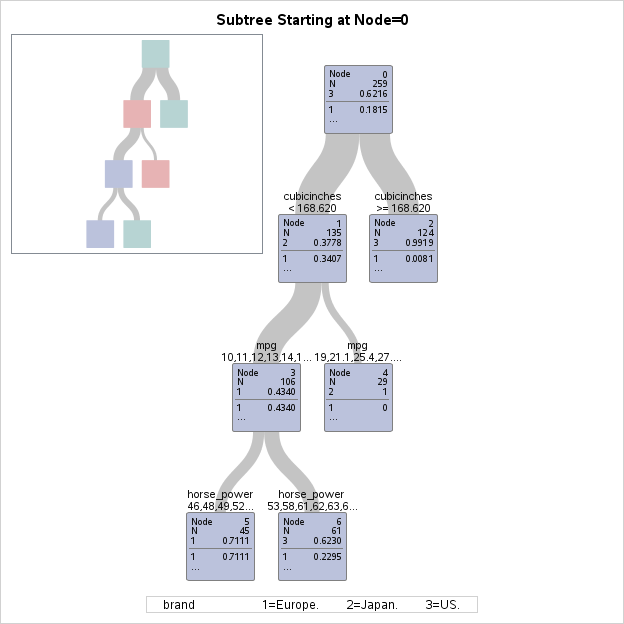

# Analysis of brand of cars 



I performed analysis of brand of cars in dependence of various parameters (see below). The analysis was performed with use of SAS.

## Remarks

* decision tree growth criterion - entropy
* pruning criterion - costcomplexity algorithm
* the most popular values were used to assign missing values

The model correctly predicted 100% of american cars, 56% of japanese cars and 68% of european cars:


## Model

* target variable: brand of car: {"Japan", "Europe", "US"}
* possible contributors to a classification tree model:
    - cubicinches of engine
    - miles per gallon of fuel
    - horsepower of engine
    - number of cylinders in engine
    - weight of car
    - time to gain speed of 60 mph

## Conclusions

1. Firstly, we see that american cars have bigger engines than european and japanese. 
1. Amongst cars with smaller engines japanese cars use visibly less fuel
1. In the group of european and american cars with similar size of engine the american cars have bigger horsepower

## Appendix (program code)

```
proc import datafile="/path/to/my/username/cars.csv" out=imported replace;

data new;
set imported;

ods graphics on;

proc hpsplit assignmissing=popular seed=67483;

class brand mpg cylinders horse_power weightlbs time_to_60 year;

model brand = mpg cylinders cubicinches horse_power weightlbs time_to_60 year;

grow entropy;
prune costcomplexity;

run;
```