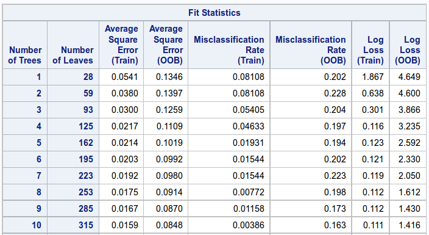

# Analysis of brand of cars with use of random forests

Random forest analysis was performed to determine brand of car (i.e. nominal value from set {"Japan", "Europe", "US"}) in dependence of following explanatory quantitative variables:

* cubicinches of engine
* range in miles per gallon of fuel
* horsepower of engine
* number of cylinders in engine
* weight of car
* time to gain speed of 60 mph

## Results and remarks

* Accuracy of random forest: 62.2%

  

* Highest relative importance score have following variables:
    - cubicinches of engine
    - number of cylinders in engine
    - range in miles per gallon of fuel

  

* Random forest growth:

  

  

## Appendix (program code)

```
proc import datafile="/path/to/my/username/cars.csv" out=imported replace;

data new;
set imported;

proc hpforest;

target brand /level=nominal;

input mpg cylinders cubicinches horse_power weightlbs time_to_60 year /level=interval;

run;
```