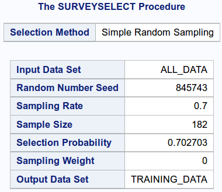
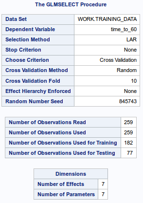
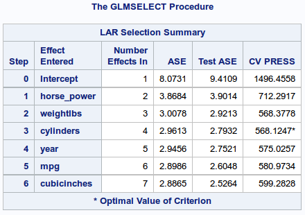
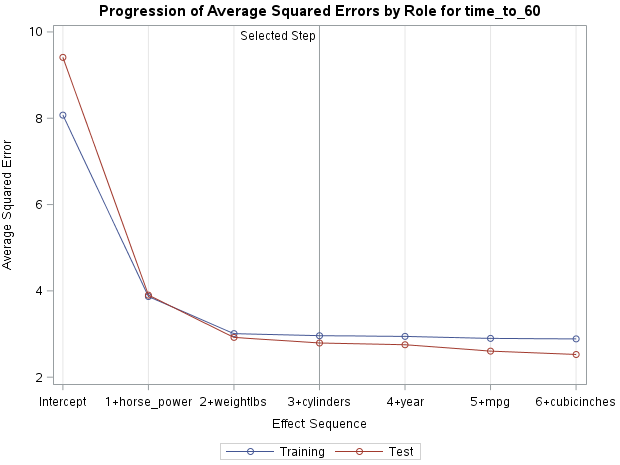
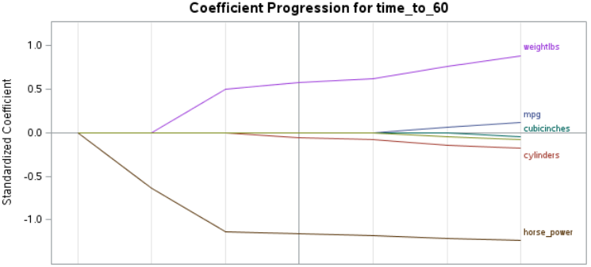

# Lasso regression analysis of dataset containing parameters of cars 

I performed lasso regression of variables essential to estimation of time needed to reach velocity of 60mph by cars.

## Description of variables

Variables used in the model:

* distance of car (miles it can ride with gallon of fuel)
* number of cylinders in engine
* size of engine (in cubicinches)
* power of engine
* weight of car
* year of production

## Way of dividing set into training and testing part

* partition: training = 0.7 of whole dataset
* splitting method: simple random sampling

## Method of choosing subset of variables

* algorithm for variable selection: least angle regression
* method of validation: cross validation with 10 folds
* each variable is tested if it can be effectively removed from the model

## Results

### Outline of procedure splitting dataset into training and testing part:



### Outline of lasso regression method



### Results of least angle regression



As we see, the bias-variance tradeof is reached for model consinting of following variables: `horse_power`, `weightlbs` and `cylinders`. The most relevant variable is `horse_power`. This fact can be depicted in following graphs:

Progression of average squared error when next variables are added to model:



Coefficient progression:



## Appendix (program code)

```
proc import datafile="/home/wwantka0/sasuser.v94/cars.csv" out=imported replace;

data all_data;
set imported;

proc surveyselect data=all_data out=training_data seed=845743
    samprate=0.7 method=srs outall;
run;

ods graphics on;

proc glmselect data=training_data plots=all seed=845743;
    partition role=selected(training='1' testing='0');
    model time_to_60 = mpg cylinders cubicinches horse_power weightlbs year / selection=lar(choose=cv stop=none) cvmethod=random(10);
run;
```

## Remarks

* `glmselect` procedure automatically standarizes variables so that they have mean equal to 0 and standard deviation equal to 1